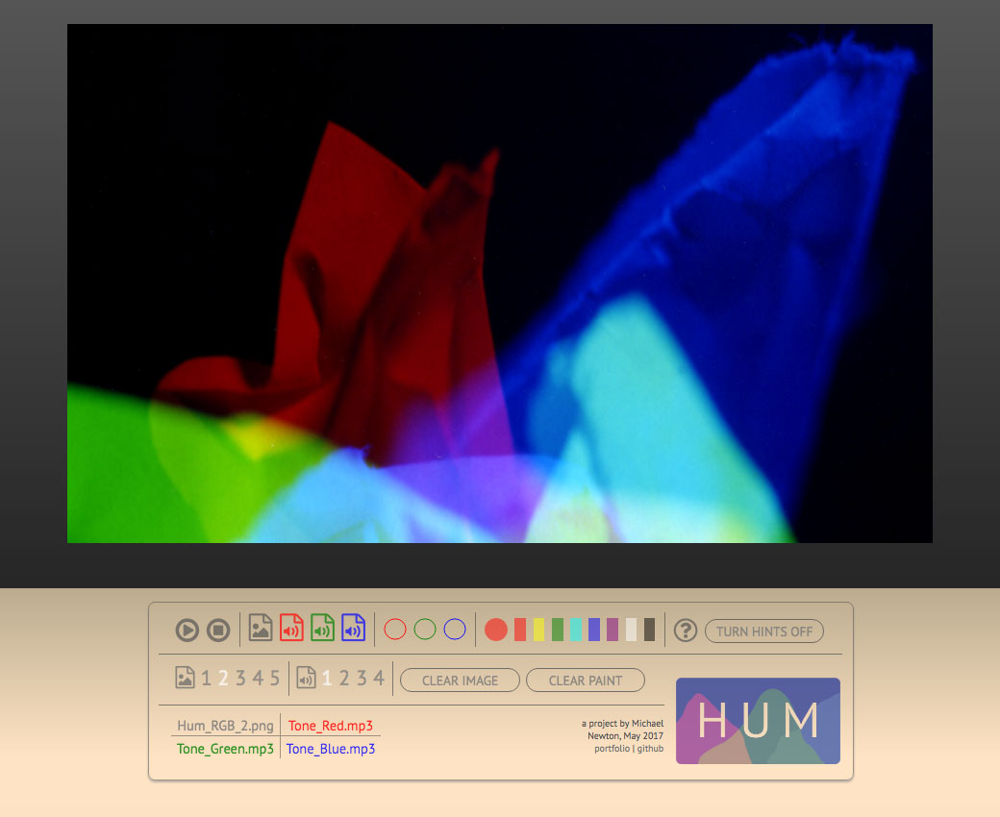
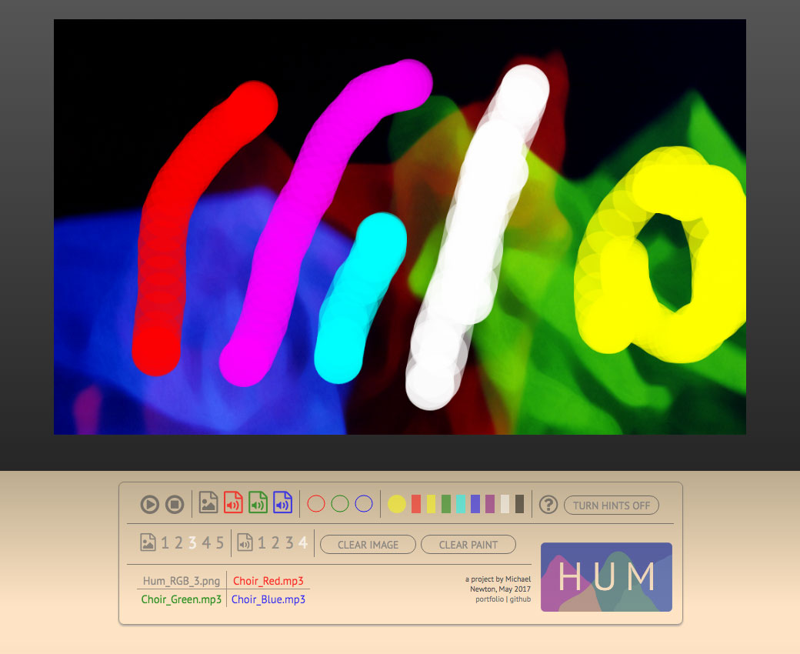

## Hum

[Hum live][app]

[app]: http://www.one-timepad.com/hum

**Hum** is a color-based, visual music/audio mixer and musical instrument. It's built with JavaScript, HTML5/Canvas, and CSS3. The goal of this project is to create a fun and intuitive music-making tool which can be easily used by people without much musical experience.

## Features & Implementation

### Audio controlled via color data

In Hum, three channels of audio are modified via the imagery in the central canvas element: the red, green and blue color channels in the canvas each modify the levels of one of three audio tracks. The individual tracks are loaded and played using an implementation of the HowlerJS library.

When a user hits the play button, they will see a playhead moving across the canvas; the speed/duration is determined by the shortest of the three audio tracks in use. At each point in the playback, the audio levels are determined by the relative amount of red, green and blue in that slice of the canvas. This was implemented with the JavaScript/Canvas `getImageData()` function, which returns color value as an array of integers. I wrote algorithms to calculate the amount of each color relative to the overall image size, and then change the audio levels accordingly.

### File uploads and sample files

Users may upload their own audio and image files. This was implemented with HTML file inputs and the HTML5 File API, with additional error handling to determine that the file has the proper extension.

If a user chooses not to use their own files, they can just use the preloaded samples. There are 5 sample images (all abstract combinations of red, green and blue) and 4 sample sets of multitrack audio (a sustained tone, a beat, a jazz band, and a choir, respectively), meant to show the capabilities of Hum.

## 'Painting' on the canvas

By clicking on the canvas element, users 'paint' color onto the element (which will then affect the audio levels). This is implemented by tracking mouse events (movement and clicks) on the canvas, and then adding colored strokes based on the position of the mouse when it was pressed and when it was released. The color is chosen via the UI buttons (see below). To enhance UX: when the mouse is positioned over the canvas, the cursor becomes a custom CSS cursor showing the size and shape of the brushstrokes.

## Button UI

Outside of the canvas element, users interact with the app via a series of buttons. The buttons are HTML elements with functionality implemented mainly through vanilla JS. These buttons are used to play/pause/stop the audio, select image and audio files to load, select colors to paint, select sample images and audio files, clear the image, clear the paint, and load the instructions modal. Hovering over the buttons brings up a tooltip window with information on that button's functionality.

There are also three SVG elements showing the volume levels for each channel. This was implemented by applying the data used to set the volume for each channel towards setting the fill color of each SVG.

Below is an early wireframe drawing showing my plans for the instructions modal:

 

## Future Directions for the Project

There are many ways this project could expand, including:
- More controls for modulating the audio.
- The ability to save files on a backend.
- The ability to integrate live video imagery rather than just static image files.
