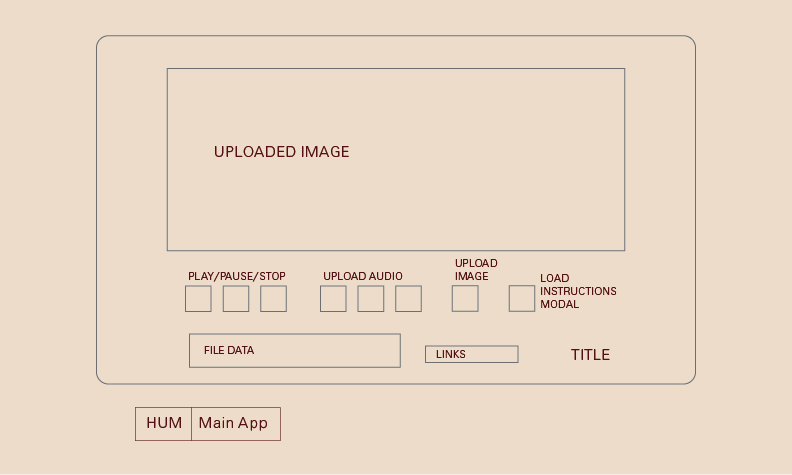

## Hum

### Background

Hum will be a tool to mix sound via images: the RGB pixel data of a given image will modulate the volume of three sound files (one for each channel). My goal for this project is that it may be a fun and intuitive music-making tool for people without much musical experience (which would include myself).

### MVP

Users will be able to:
- Upload image and sound files.
- Play/pause/stop the music.
- **Addition:** Draw colors to the canvas to affect the sound.

The app will:
- Modulate sound via an image's RGB color data.
- Display uploaded images and play uploaded sound.
- Display relevant file names

There will also be:
- A modal with information on how to use the app.
- a production README.

### Technologies

This project will be implemented with:
- `Howler.js` - a JS library for working with sound.
- The `HTML5 Canvas` and `File` APIs (allows for uploading files without a backend).
- The `Canvas`'s `getImageData()` function.
- `Webpack` to bundle files.

There will be individual scripts to handle distinct elements of the app: `display.js` for the main display, `sound_file.js` to handle individual sound files, and `modulate.js` to handle the actual work of modifying the sound files.

### Wireframes

The app will consist of a single screen (plus the instructions modal). There will be simple controls to upload files and to play/pause/stop the audio. There will also be links to my own sites (Github, LinkedIn, etc.). Most of the app will be given over to the uploaded image - in a sense this app can also function as a sort of gallery display for a given image.

### Implementation Timeline

**Day 1:** Test out the basics of the technologies/libraries I'm implementing - make sure I'm able to upload files via the Canvas, play multiple audio files via Howler, etc. Also, work on overall visual layout.

**Day 2:** Go further into these technologies - modulate audio files via Howler, get pixel data via the Canvas, etc.

**Day 3:** Build out the core logic of the app - the goal is to be able to upload audio and image files and to gradually modulate the audio files based on the pixel data in individual images.

**Day 4:** Add styling to the controls. Add the instructions modal, links, etc.

### Bonus Features

Once the basics are working, there are all sorts of ways this project could expand, including:
- More controls for modulating the audio.
- The ability to save files on a backend.
- The ability to integrate live video imagery rather than just static image files.
